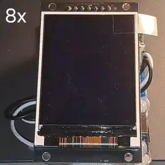
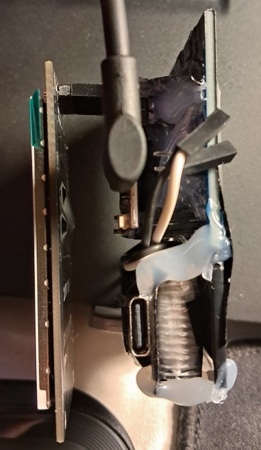
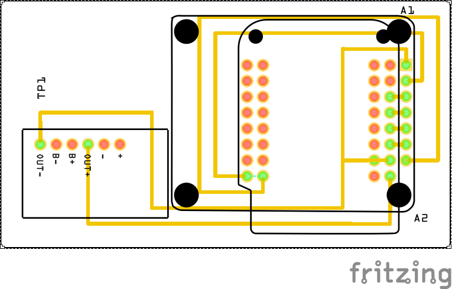
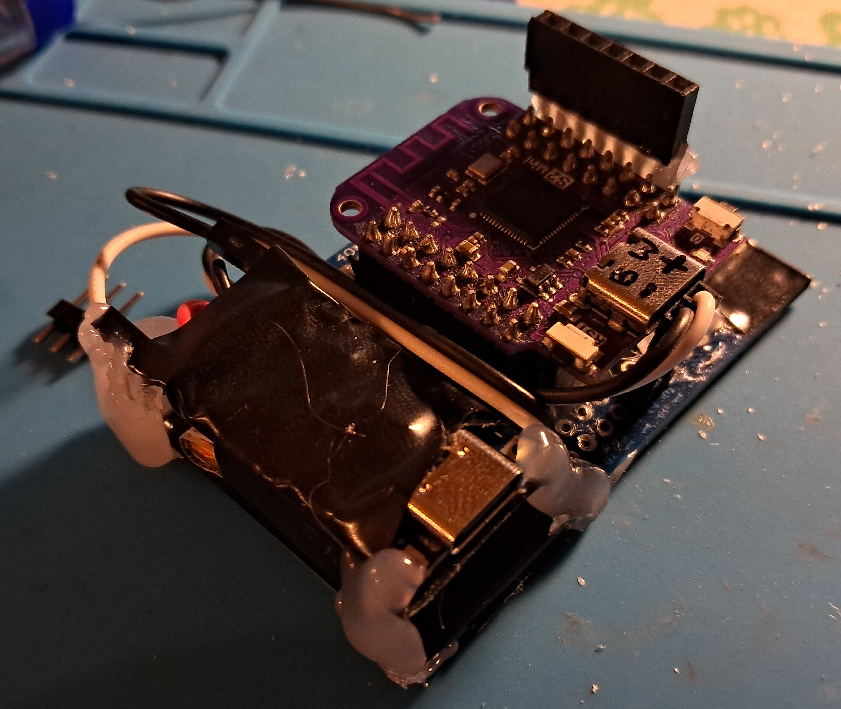
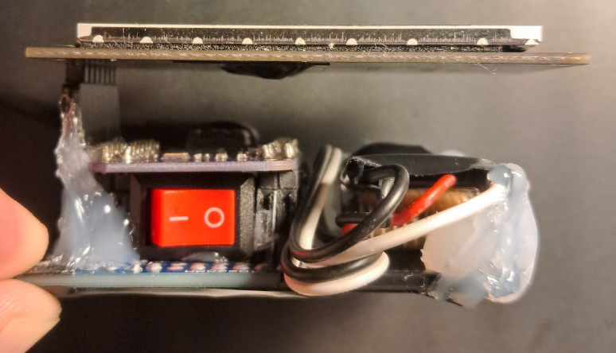

# Animated Badge
Weekend project based on ESP32-S2 mini, 2" TFT ST7789 240x320 RGB display, and some janky soldering. It took precisely 2 evenings to make.

That's a badge, not just a display, because it has some room between the display and other hardware. So, you can wear it in/on your shirt's pocket.

Also, it features USB-C charging and ~45-60 minutes of autonomy.

## Dependencies
- [Adafruit_ST7789 library](https://github.com/adafruit/Adafruit-ST7735-Library/tree/master)
- [QR Code generator library](https://www.nayuki.io/page/qr-code-generator-library)
- [Image to C++ Byte Array Converter](https://image2cpp.42web.io/)

## How to run
As with every ESP32 project with the Arduino core, install https://github.com/espressif/arduino-esp32 via the boards manager. Arduino core lowers the entry point for most people. Arduino == easy(ier).

Open `badge.ino` using Arduino IDE

Change the name, description, and image (`photo.h`) to yours.

Select LOLIN32-S2 mini or your board if you use a different one (don't forget to change the TFT_MOSI and TFT_SCLK accordingly)

Wire/solder everything correctly. Double-check SCL and SDA connections.

[For ESP32-S2 mini] hold BOOT (0), press&release RESET (RST), then release BOOT

Upload the code

## Story
I got myself a small display I've been wanting to experiment with for a long time. The idea occurred spontaneously.

First, I created a breadboard prototype and played with the display for a little while.

Then, I decided to make it more rigid by using a prototyping board. I created a PCB design in Fritzing because it's really easy to use for quick prototyping, and it has a large number of parts readily available.

I used a soldering iron to trace the board and made a rigid connection between components.

Also, I made the prototype modular - each part can be quickly disconnected and swapped.

This prototype includes a 200 mAh Li-Ion battery and a BMS board. I used a hot glue gun to fix them in place. Based on 3 tests, it can display the animation for ~45-60 minutes. Autonomy changes are mandatory.

The power can be disconnected using an on-board switch. Also, the board features an additional safety feature. ESP module can't be programmed without physically disconnecting the battery - connecting pins are blocking the USB port.

I may not have a 3D printer or fancy equipment, but I do have free will, programming knowledge, a soldering iron, lots of electrical tape, a hot glue gun, and many ideas.